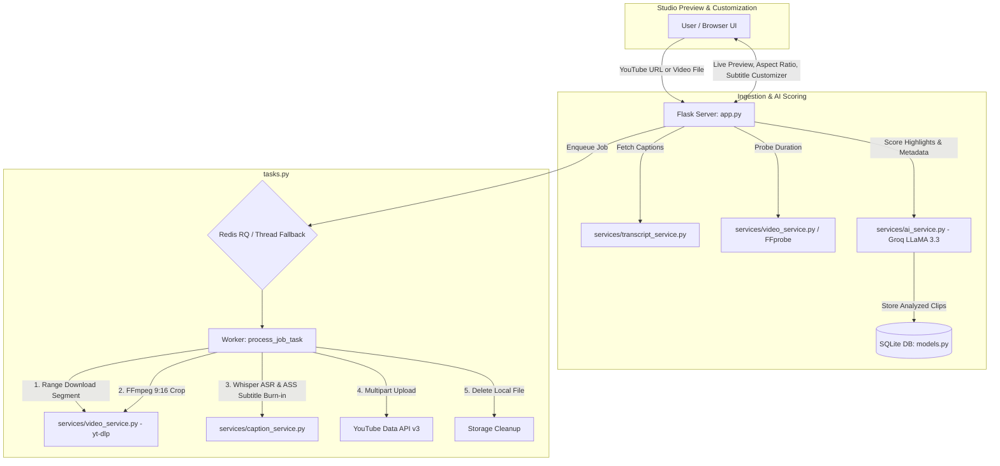

# 🎬 Clip-Forge (ClipAI Studio)

> **AI-Driven Viral Short-Form Video Generator & Auto-Publisher**  
> Transform long-form YouTube videos or local video files into high-retention 9:16 vertical clips (Shorts, Reels, TikToks) with AI highlight detection, kinetic animated captions, and direct YouTube publishing.


---

## 📑 Table of Contents
1. [Overview & Core Features](#-overview--core-features)
2. [Architecture & Data Flow](#-architecture--data-flow)
3. [Technology Stack](#-technology-stack)
4. [Project Structure](#-project-structure)
5. [Prerequisites & Environment Setup](#-prerequisites--environment-setup)
6. [Quick Start Guide](#-quick-start-guide)
7. [API Reference](#-api-reference)
8. [Pipeline Deep-Dive](#-pipeline-deep-dive)
9. [Configuration Reference (`.env`)](#-configuration-reference-env)
10. [Troubleshooting & FAQ](#-troubleshooting--faq)

---

## 🌟 Overview & Core Features

Clip-Forge is an automated video repurposing pipeline that converts long videos into viral short-form content:

- **🧠 Intelligent Highlight Scoring**: Uses Groq LLMs (`llama-3.3-70b-versatile`) to evaluate transcripts, identify conversational hooks, punchlines, and dramatic moments, and extract optimal 45–60s segments.
- **⚡ Smart Range Downloading**: Employs `yt-dlp` download range filters to fetch **only the needed timestamp segment** instead of downloading whole gigabytes of source video.
- **🎙️ Word-Level Kinetic Captions**: Transcribes audio using `faster-whisper` (`tiny` model, `int8` CPU quantization) to generate synchronized word-by-word animated ASS subtitles (TikTok Pop, Bounce, and Minimal styles).
- **📐 9:16 Vertical Formatting**: Dynamically crops, scales, and pads horizontal video into vertical short-form format with 44.1kHz AAC stereo audio via FFmpeg.
- **🚀 One-Click YouTube Shorts Publishing**: Integrates Google OAuth 2.0 and YouTube Data API v3 multipart upload to post clips directly as YouTube Shorts.
- **📁 Local Video Upload Support**: Upload any local video file (MP4, MOV, MKV, WebM) directly from your computer for instant processing.
- **🛡️ Resilient Architecture**: Gracefully falls back from Redis/RQ to Python background threads, and from Whisper ASR to text distribution if external services are unreachable.
- **🧹 Automatic Storage Hygiene**: Automatically deletes processed local clip files immediately after successful YouTube upload, with an automated 24-hour cleanup cron for temporary data.

---

## 🏗️ Architecture & Data Flow



---

## 💻 Technology Stack

| Component | Technology | Description |
| :--- | :--- | :--- |
| **Backend** | Python 3.9+, Flask 2.3+ | REST API server, routing, rate limiting |
| **Database** | SQLite + Flask-SQLAlchemy | Persistent storage for jobs, clips, and metadata |
| **Task Queue** | Redis 5+ & RQ (Redis Queue) | Background worker queue with daemon thread fallback |
| **AI / LLM** | Groq API (`llama-3.3-70b-versatile`) | High-speed transcript analysis and SEO metadata generation |
| **Speech Recognition** | `faster-whisper` | Fast local ASR for word-level subtitle timing |
| **Video Processing** | `yt-dlp` & `imageio-ffmpeg` (FFmpeg) | Range downloading, aspect ratio transformation, subtitle rendering |
| **Publishing** | YouTube Data API v3, Google OAuth2 | Multipart video upload & authentication |
| **Frontend** | HTML5, Tailwind CSS, Vanilla JavaScript | Responsive single-page application with dark glassmorphic UI |

---

## 📂 Project Structure

```
Clip-forge/
├── .env.example                # Example environment variables & configuration
├── .gitignore                  # Git ignore rules for Python, SQLite, and video clips
├── README.md                   # Project documentation
├── requirements.txt            # Python dependencies
├── app.py                      # Flask app, API routes, rate limiting, and server startup
├── models.py                   # SQLAlchemy schema (Job, Clip), auto-migrations & cleanup
├── tasks.py                    # Background task runner & YouTube Data API uploader
├── clips/                      # Directory for downloaded segments and rendered MP4 clips
│   └── .gitkeep
├── services/
│   ├── __init__.py
│   ├── ai_service.py           # Groq LLM integration for virality scoring & metadata
│   ├── caption_service.py      # Whisper word-level ASR, ASS subtitle generator & burn-in
│   ├── transcript_service.py   # YouTube transcript fetcher & prompt formatting
│   └── video_service.py        # yt-dlp range segment streaming & FFmpeg transformation
└── templates/
    └── index.html              # Full Single Page Application (Dashboard, Studio, Library)
```

---

## ⚙️ Prerequisites & Environment Setup

### 1. Requirements
- **Python**: Version 3.9 or higher
- **FFmpeg**: Handled automatically via `imageio-ffmpeg`, but system FFmpeg is recommended for optimal performance.
- **Redis** *(Optional)*: If Redis is not running locally, the application automatically falls back to background Python threads.

### 2. API Keys Needed
- **Groq API Key**: Obtain a free, ultra-fast API key at [console.groq.com](https://console.groq.com).
- **YouTube Data API v3 Key**: Created in the [Google Cloud Console](https://console.cloud.google.com).
- **Google OAuth 2.0 Client ID**: Created under Google Cloud Console Credentials (Web application type) with authorized JavaScript origins: `http://localhost:5000` and `http://127.0.0.1:5000`.

---

## 🚀 Quick Start Guide

### Step 1: Clone Repository & Create Virtual Environment
```bash
git clone https://github.com/huzaifasafdar310/Clip-forge.git
cd Clip-forge

# Create and activate virtual environment
python -m venv venv
# On Windows:
.\venv\Scripts\activate
# On Linux/macOS:
source venv/bin/activate
```

### Step 2: Install Dependencies
```bash
pip install -r requirements.txt
```

### Step 3: Configure Environment Variables
Copy `.env.example` to `.env` and fill in your keys:
```bash
cp .env.example .env
```
Edit `.env`:
```ini
FLASK_ENV=development
FLASK_DEBUG=0
FLASK_PORT=5000
FLASK_HOST=127.0.0.1
SECRET_KEY=your-secure-random-secret-key

YOUTUBE_API_KEY=your_youtube_api_key_here
GOOGLE_OAUTH_CLIENT_ID=your_google_oauth_client_id_here
GROQ_API_KEY=your_groq_api_key_here

REDIS_URL=redis://localhost:6379/0
SQLALCHEMY_DATABASE_URI=sqlite:///yt_upl2.db
```

### Step 4: Run Application
```bash
python app.py
```
Open your browser and navigate to:
```
http://127.0.0.1:5000
```

---

## 📡 API Reference

### 1. Ingestion & Analysis
- **`POST /api/analyze`**
  - **Description**: Analyzes a YouTube video URL, fetches transcripts, scores highlights with Groq, and generates metadata.
  - **Body**:
    ```json
    { "url": "https://www.youtube.com/watch?v=VIDEO_ID", "num_clips": 3 }
    ```
  - **Response**: Returns YouTube metadata and list of analyzed clip objects.

- **`POST /api/analyze-local`**
  - **Description**: Uploads and processes a local video file (Multipart Form).
  - **Form Data**:
    - `video`: File binary (`.mp4`, `.mov`, `.mkv`, etc.)
    - `num_clips`: Number of clips requested (1-10)
    - `title`: Optional custom title

### 2. Processing & Publishing
- **`POST /api/upload`**
  - **Description**: Enqueues background job to cut, caption, and publish selected clips to YouTube Shorts.
  - **Body**:
    ```json
    {
      "clips": [{ "id": 1, "privacyStatus": "public", "title": "Viral Moment", "description": "..." }],
      "access_token": "ya29.a0..."
    }
    ```
  - **Response**: `{ "job_id": "uuid-string" }`

- **`GET /api/status/<job_id>`**
  - **Description**: Real-time polling endpoint to check status of a background job and individual clips (`analyzed`, `downloading`, `processing`, `uploading`, `completed`, `failed`).

- **`GET /api/download/<clip_id>`**
  - **Description**: On-demand cuts and returns the rendered MP4 file directly for local download.

- **`PATCH /api/clip/<clip_id>/caption-style`**
  - **Description**: Updates subtitle styling preferences and re-renders captions.
  - **Body**:
    ```json
    {
      "caption_style": "tiktok_pop",
      "caption_font": "Arial Black",
      "caption_color": "#FFFF00",
      "caption_language": "auto",
      "has_captions": true
    }
    ```

### 3. Projects & Maintenance
- **`GET /api/projects`**: Returns recent clips, completed jobs, and aggregate statistics for the dashboard.
- **`POST /api/admin/cleanup`**: Triggers manual deletion of DB records and video files older than 24 hours.

---

## 🔍 Pipeline Deep-Dive

### 1. Range-Based Segment Streaming
Instead of pulling an entire 2-hour 1080p source video (several gigabytes), [`download_clip_segment()`](file:///c:/Users/Huzaifa%20Ali/Desktop/coding/projects/hiring/Clip-forge/services/video_service.py) utilizes `yt-dlp`'s `download_ranges` callback with a 2-second seeking buffer:
```python
ydl_opts = {
    'format': 'best[ext=mp4][height<=720]/best[height<=720]/best',
    'download_ranges': yt_dlp.utils.download_range_func(None, [(seg_start, seg_end)]),
    'extractor_args': {'youtube': {'player_client': ['web', 'ios', 'android']}},
}
```
This reduces download time from minutes to just a few seconds while evading YouTube bot throttling.

### 2. Kinetic Subtitle Engine (`.ass` Format)
1. **Audio Extraction**: Audio is extracted as 16kHz mono WAV via FFmpeg.
2. **Word-Level ASR**: `faster-whisper` produces exact millisecond boundaries for each spoken word.
3. **ASS Compilation**: Generates Advanced SubStation Alpha subtitle events with dynamic scale and color transformations:
   - **TikTok Pop**: Active word scales to 115% with a vibrant accent color (`{\c&H0000FFFF\fscx115\fscy115}WORD{\r}`).
   - **Bounce Animation**: Uses ASS timing transforms (`{\c&H00... \fscx130\fscy130\t(0,100,\fscx100\fscy100)}`).
4. **Hardware-Accelerated Burn-in**: Burned into the video stream using FFmpeg's `ass` video filter (`-c:v libx264 -preset ultrafast -crf 22`).

---

## ⚙️ Configuration Reference (`.env`)

| Variable | Default | Purpose |
| :--- | :--- | :--- |
| `FLASK_ENV` | `development` | Flask runtime environment (`development` / `production`) |

| `FLASK_DEBUG` | `0` | **Must be `0` in production.** Enables hot reloading and interactive debugger in development |
| `FLASK_PORT` | `5000` | Local HTTP server port |
| `FLASK_HOST` | `127.0.0.1` | Local HTTP server host interface |
| `SECRET_KEY` | — | **Required.** Cryptographic key for session cookies |
| `ENCRYPTION_KEY` | — | **Required.** 32-byte Fernet key for encrypting OAuth tokens at rest |
| `YOUTUBE_API_KEY` | — | **Required.** Google API key to query YouTube video details |
| `GOOGLE_OAUTH_CLIENT_ID` | — | **Required.** OAuth 2.0 Client ID for in-browser Google login |
| `GOOGLE_OAUTH_CLIENT_SECRET` | — | **Required for token refresh.** OAuth 2.0 Client Secret |
| `GROQ_API_KEY` | — | **Required.** Groq Cloud API key for LLaMA 3.3 70B inference |
| `ADMIN_API_KEY` | — | **Required in production.** Key for `POST /api/admin/cleanup` |
| `REDIS_URL` | `redis://localhost:6379/0` | *Optional.* Redis job queue (falls back to threads if unavailable) |
| `SQLALCHEMY_DATABASE_URI` | `sqlite:///yt_upl2.db` | *Optional.* SQLAlchemy database URI. Use PostgreSQL in production |
| `WHISPER_MODEL_SIZE` | `tiny` | *Optional.* Faster-Whisper model size (`tiny` / `base` / `small` / `medium`) |
---

## 🚀 Production Deployment

> **Important:** Flask's built-in development server (`app.run()`) is **not production-safe**.
> Use `gunicorn` behind a reverse proxy that handles TLS termination.

### 1. Install gunicorn
```bash
pip install gunicorn
```

### 2. Start the application
```bash
# 4 sync workers (adjust to (2 × CPU cores) + 1)
FLASK_ENV=production gunicorn app:app --workers 4 --bind 127.0.0.1:5000 --timeout 120
```

### 3. nginx TLS reverse proxy (example)
```nginx
server {
    listen 80;
    server_name yourdomain.com;
    return 301 https://$host$request_uri;  # Force HTTPS
}

server {
    listen 443 ssl http2;
    server_name yourdomain.com;

    ssl_certificate     /etc/letsencrypt/live/yourdomain.com/fullchain.pem;
    ssl_certificate_key /etc/letsencrypt/live/yourdomain.com/privkey.pem;

    # Large upload support (adjust to match MAX_CONTENT_LENGTH in app_factory.py)
    client_max_body_size 2048M;

    location / {
        proxy_pass         http://127.0.0.1:5000;
        proxy_set_header   Host $host;
        proxy_set_header   X-Real-IP $remote_addr;
        proxy_set_header   X-Forwarded-For $proxy_add_x_forwarded_for;
        proxy_set_header   X-Forwarded-Proto $scheme;
        proxy_read_timeout 300s;  # Long timeout for video upload
    }
}
```

> **TLS Note:** HTTPS/TLS termination is the **reverse proxy's responsibility**.
> ClipAI Studio sets `Strict-Transport-Security` headers in production mode
> but does NOT perform HTTP→HTTPS redirects internally — your nginx/Caddy/load
> balancer must enforce this so no request reaches the app over plain HTTP.

### 4. Production checklist
- [ ] Set `FLASK_ENV=production` and `FLASK_DEBUG=0`
- [ ] Generate unique `SECRET_KEY` and `ENCRYPTION_KEY` values
- [ ] Set all required API keys in `.env`
- [ ] Configure nginx with a Let's Encrypt certificate
- [ ] Start Redis for reliable background job processing
- [ ] Consider PostgreSQL over SQLite for concurrent write workloads
- [ ] Set up `cron` or a systemd timer to call `POST /api/admin/cleanup` daily

---

## ❓ Troubleshooting & FAQ


### 1. Redis Connection Warning
- **Symptom**: `Redis unavailable. Background tasks will run using Thread fallback.`
- **Resolution**: This is normal if Redis is not installed. Clip-Forge will seamlessly run asynchronous tasks using Python background threads. To enable Redis, start a local Redis server (`redis-server`).

### 2. YouTube 403 Forbidden / Rate Limits
- **Symptom**: `Video download failed: HTTP Error 403: Forbidden`
- **Resolution**: `services/video_service.py` is configured with multi-client rotation (`web`, `ios`, `android`) and desktop browser user-agents. Ensure your `yt-dlp` package is kept up to date (`pip install --upgrade yt-dlp`).

### 3. Google OAuth "Origin Not Allowed"
- **Symptom**: Google Sign-In popup errors with `redirect_uri_mismatch` or `origin_mismatch`.
- **Resolution**: In Google Cloud Console under OAuth 2.0 Client ID, add `http://localhost:5000` and `http://127.0.0.1:5000` to **Authorized JavaScript Origins**.

---

## 📄 License

This project is released under the [MIT License](LICENSE).
